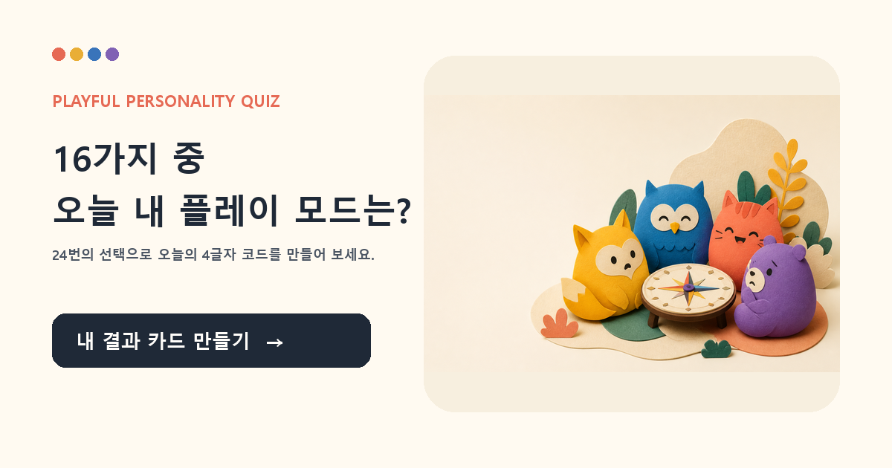

# 선택코드 플레이룸

> **16가지 중, 오늘 내 플레이 모드는?**
> 24개의 상황 선택으로 오늘의 4글자 코드와 결과 카드를 만드는 **비공식 놀이 퀴즈**입니다.

**라이브 데모:** https://shinjaehyun20.github.io/personality-playroom/

## 왜 만들었나요

같은 하루도 어떤 날은 사람 속에서 에너지를 얻고, 어떤 날은 혼자 정리하며 다시 시작합니다. 정답을 판정하는 대신, 24개의 작은 장면에서 더 자주 끌린 방향을 모아 **오늘의 플레이 모드**를 보여줍니다.

## 경험 흐름

1. 24개 일상 상황에서 처음 끌리는 선택을 고릅니다.
2. E/I, S/N, T/F, J/P 네 축을 각각 6개 장면에서 로컬로 계산합니다.
3. 16개 코드 중 하나와 캐릭터·한 줄 플레이·오늘의 재미 미션을 확인합니다.
4. 내 코드·캐릭터·훅·미션이 담긴 **개인 결과 PNG 카드**를 공유합니다.
   - 지원 브라우저: 이미지와 문구를 시스템 공유 시트로 전송
   - 미지원 브라우저: PNG 다운로드 + 공유 문구 복사

## 공개/안전 경계

- 공식 MBTI 검사, 심리·의학 진단, 능력 평가, 궁합·예측이 아닙니다.
- 희귀도·순위·통계적 정확성을 주장하지 않습니다.
- 결과는 브라우저 안에서만 계산하며, 로그인·추적·서버 저장이 없습니다.
- X 레퍼런스에서는 짧은 퀴즈 퍼널과 일러스트 중심의 발견 흐름만 관찰했습니다. 브랜드·문구·유형 체계·희귀도 주장·캐릭터 자산은 사용하지 않았습니다.

## 공개면 품질

- **SEO:** 고유 title·description·canonical·robots·sitemap
- **소셜 미리보기:** Open Graph·X Card·1200×630 OG 이미지·이미지 alt
- **AEO/GEO:** Korean `WebApplication` JSON-LD, 명확한 목적·비공식 경계·FAQ에 답할 수 있는 README
- **모바일:** 1열 레이아웃, 키보드 포커스, 결과 PNG 공유 fallback

재사용 가능한 공개 웹사이트 가시성 게이트는 [`docs/publication/seo-aeo-geo-checklist.md`](docs/publication/seo-aeo-geo-checklist.md)를 따릅니다.

## 로컬 실행

`index.html`을 최신 브라우저로 여세요. 의존성, 설치, 로그인, 서버가 없습니다.

## 파일

- `index.html` — 정적 앱 및 SEO/OG/JSON-LD 메타데이터
- `assets/og-cover.png` — 링크 공유용 1200×630 OG 커버
- `assets/types/*.png` — 결과별 오리지널 캐릭터 아트
- `assets/social/` — X·Threads·Instagram 게시 준비용 분리 이미지
- `docs/publication/` — SNS 카피와 SEO·AEO·GEO 공개 게이트
- `manifest.json` — 파일 해시 및 자산 원본 메타데이터
